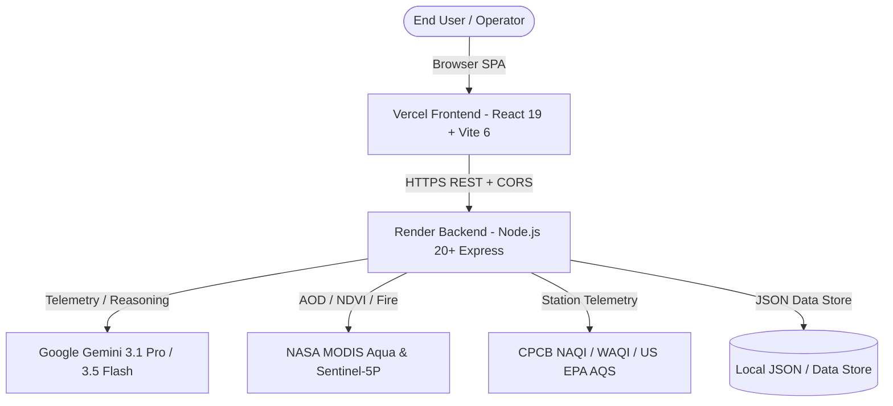

# Developer & AI Agent Guide — AuraPredict AI

Welcome to **AuraPredict AI**, an enterprise-grade atmospheric intelligence, generative forecasting, and proactive clean-air mitigation system. This document serves as the canonical technical entry point for human engineers, AI agents, and autonomous coding tools.

---

## 🏛️ System Architecture Overview



### Key Architectural Layers

1. **Frontend (`src/`)**:
   - **Framework**: React 19 + TypeScript + Vite 6 + Tailwind CSS v4.
   - **State & Contexts**: `useAQI`, `useAuth`, `useGPS`, `useOfflineSync`, `useTheme`.
   - **Centralized API Client**: `src/services/api.ts` utilizing `VITE_API_URL` for production decoupled cross-origin communication with automatic fallback.
   - **Visualizations**: D3.js, Leaflet GIS mapping, Recharts, Motion animations.

2. **Backend Server (`server.ts` & `server/`)**:
   - **Runtime**: Express 4.x on Node.js 20+.
   - **Security**: Helmet, dynamic CORS supporting `.vercel.app` & `ALLOWED_ORIGINS`, Express Rate Limiters for General API (180/min), AI API (50/min), and Auth (30/15min).
   - **Port & Host Binding**: Dynamic `PORT = Number(process.env.PORT) || 3000` listening on `0.0.0.0`.
   - **Endpoints**: Health (`/api/health`), Metrics (`/api/metrics`), Predictions (`/api/predict/forecast`), Swarm LLM (`/api/agent/weather-forecasting-llm`), Policy Sim (`/api/policy/simulate`), Health Advisor (`/api/health/advisor`), Image Diffuser (`/api/gemini/generate-image`), Transcribe (`/api/gemini/transcribe`), Real-world Datasets (`/api/datasets/*`).

3. **Database & Persistence (`server/db.ts` & `data/`)**:
   - Atomic JSON database with automated backups (`aurapredict_database.json` & `.bak.json`).
   - PBKDF2 cryptographic password hashing and session token verification.

---

## 🚦 Continuous Integration (CI/CD) Gates

All pull requests and merges must pass the standard quality gates:

```bash
# 1. Type check & Linting
npm run lint

# 2. Automated Test Suite (Vitest)
npm run test

# 3. Production Build & Bundling
npm run build

# Or execute all in sequence:
npm run check
```

---

## 💻 Code Quality & Style Conventions

1. **Strict TypeScript**: Avoid `any` where explicit types exist in `src/types/index.ts`.
2. **Deterministic Fallbacks**: All AI and external endpoints must include deterministic physics/mathematical fallbacks to maintain resilience during API quota exhaustion or offline operations.
3. **Cross-Origin Safety**: Always route frontend HTTP requests through `src/services/api.ts` using `apiFetch` or `apiUrl` rather than hardcoding origin URLs.
4. **Environment Isolation**: Never commit API keys or session secrets. Use `.env.example` as the canonical template.

---

## 📚 Technical References

- **[ARCHITECTURE.md](ARCHITECTURE.md)**: Deep dive into PINN, GNN, and physical dispersion formulations.
- **[CONTEXT.md](CONTEXT.md)**: Domain glossary for atmospheric chemistry, remote sensing, and physics definitions.
- **[API.md](API.md)**: Complete OpenAPI 3.0 specification for all REST endpoints.
